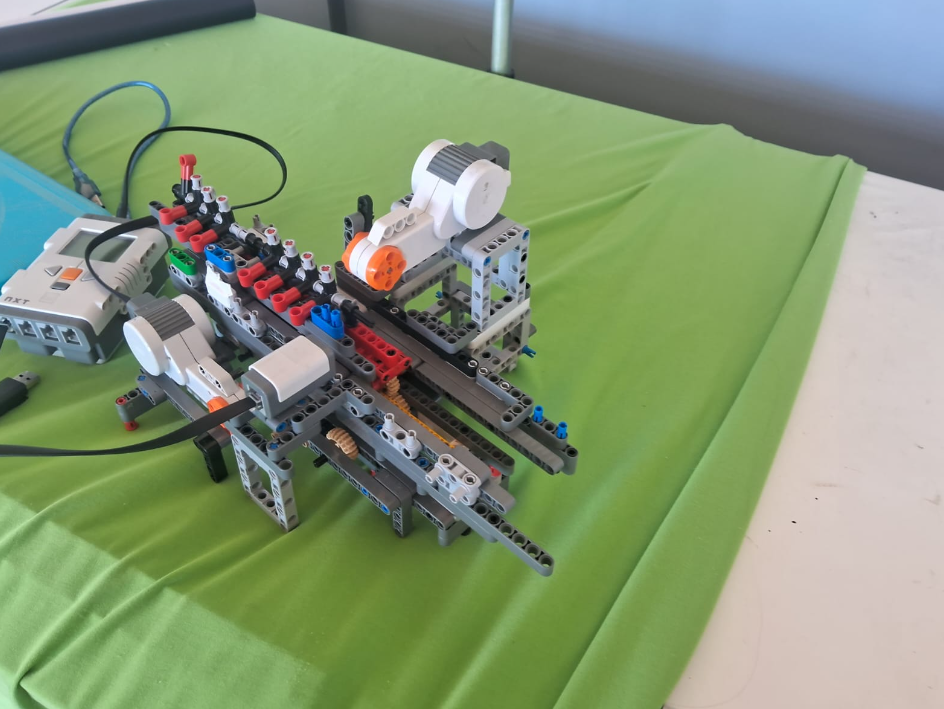
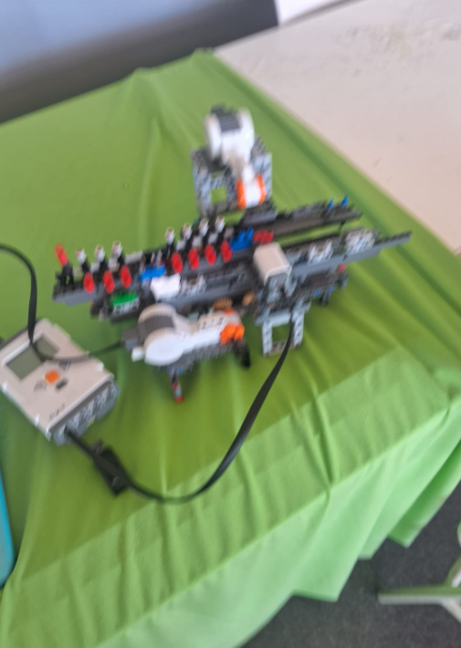
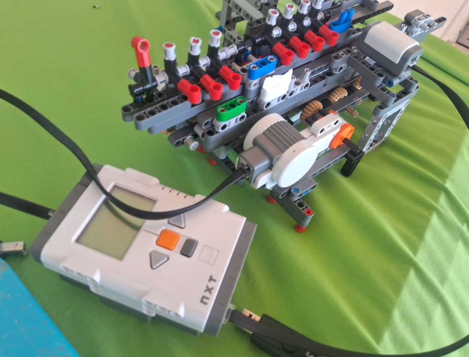
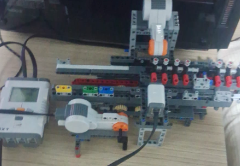

# Lego NXT Turing Machine
A Turing Machine Implementation based on LEGO Mindstorms NXT
 

 
I made it to UFSM-CS's Science Fair in 2023.
Code is far from perfect, but it got a very high success rate in all of my tests.
Have fun!

#Why NXT?
NXT was the only STEM Kit avaliable for me, because the robotics course couldn't borrow an newer STEM Kit for me, and even though it is pretty old, it is equally powerful.
